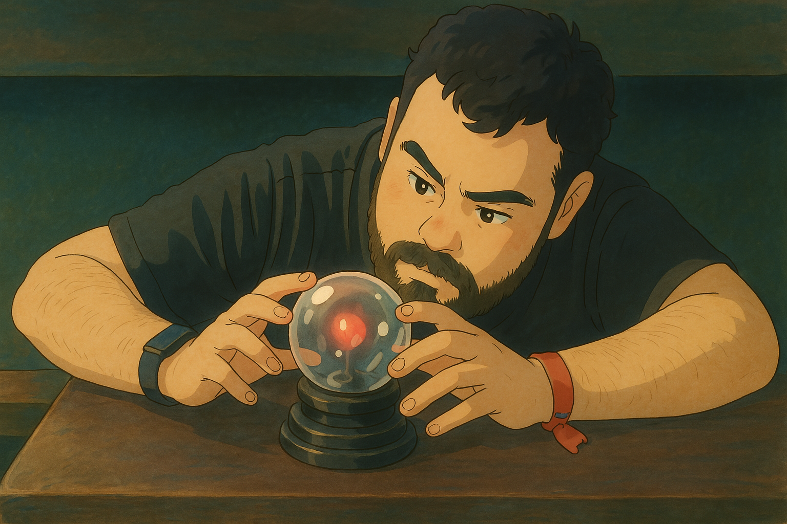

# About me

Writer, musician, cyclist, and developer from Chile. Born in Concepción but raised in Santiago. Despite a background in Hispanic Linguistics, Literature, and Music History (with a Master’s in Publishing), I pivoted to tech and now work as a Fullstack JavaScript/Python and XR Game Developer.

I’m very passionate about everything that involves Game Development and Home Automation. I am always in the lookout for new knowledge!

### 🛠️ Technical Skills  
- **Frontend**: React, JavaScript, TypeScript 
- **Backend**: Node.js, Express.js, Django (Python)  
- **Game Dev**: Unity (C#), Unreal Engine (C++)  
- **Cloud/DevOps**: AWS (EC2, S3, RDS), Docker, Terraform, Ansible
- **Cybersecurity**: Wazuh SIEM, Windows AD | Linux Bash, VirtualBox | VMWare  

### 🌐 Languages  
- Spanish (Native), English (C2 Proficient EFS English - TOEIC B2 Certified)  

### 📌 Contact Me
Let's connect! Reach me on LinkedIn or explore my projects below:

💼 [My LinkedIn](https://www.linkedin.com/in/francisco-v-diaz)
🎮 [GameDev Portfolio](https://www.artstation.com/spy0x)
🕹️ [My Itchio Games](https://spy0x.itch.io)

#### Others
🎹 Fun fact: I also create piano covers! Check my YouTube channel [here!](https://www.youtube.com/spy0x).
